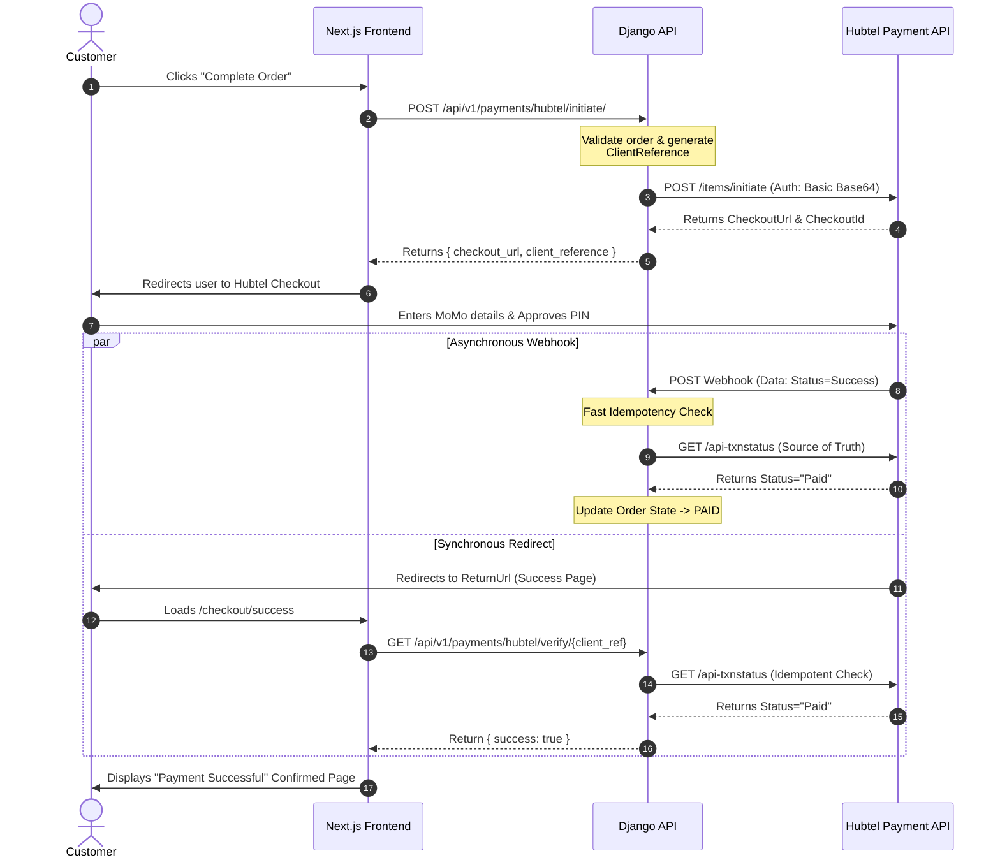

# Hubtel UAT Submission
**Client:** London's Imports
**Platform:** Next.js + Django REST Framework
**Live URL:** [www.londonsimports.com](https://www.londonsimports.com) / [Vercel Preview](https://london-import-frontend-6vpr4c074-gabriel-anapeys-projects.vercel.app)

---

## 1. End-User Perspective Testing
We have successfully implemented and tested the Hubtel Redirect Checkout. The end-user flow consists of:
1. User selects "Pay with Mobile Money / Hubtel" at checkout.
2. The user is redirected to the secure Hubtel Checkout Portal via the `CheckoutUrl` returned from the API.
3. The user inputs their Mobile Money details, approves the prompt on their phone, and is successfully redirected back to the London's Imports `/checkout/success` page.

## 2. Sample Callback Received
Below is the real callback payload we successfully received and processed from Hubtel via our designated webhook endpoint (`/api/v1/payments/hubtel/webhook/`).

```json
{
  "Data": {
    "Amount": 1.01,
    "Status": "Success",
    "CheckoutId": "ead61a2452d04d83aaf07c0e4e129bd9",
    "Description": "The MTN Mobile Money payment has been approved and processed successfully.",
    "PaymentDetails": {
      "Channel": "mtn-gh",
      "PaymentType": "mobilemoney",
      "MobileMoneyNumber": "233545142658"
    },
    "SalesInvoiceId": "a8fb848b9dce4a4db4055071c0243c16",
    "ClientReference": "2026061300998-1781509618-df09",
    "CustomerPhoneNumber": "233545142658"
  },
  "Status": "Success",
  "ResponseCode": "0000"
}
```

## 3. Sample Transaction Status Check Response
Whenever a callback is received, or a user returns to our success page, we ping the `api-txnstatus` endpoint as the ultimate source of truth. Below is a sample response we parse:

```json
{
  "responseCode": "0000",
  "message": "Success",
  "data": {
    "amount": 1.01,
    "charges": 0.0,
    "amountAfterCharges": 1.01,
    "description": "Payment for Order LI-2026-1029",
    "clientReference": "2026061300998-1781509618-df09",
    "transactionId": "123456789012345",
    "externalTransactionId": "MOMO123456789",
    "amountCharged": 1.01,
    "paymentMethod": "MobileMoney",
    "status": "Paid"
  }
}
```

## 4. Production Links
- **Primary Domain:** [https://www.londonsimports.com](https://www.londonsimports.com)
- **Staging / Vercel App:** [https://london-import-frontend-6vpr4c074-gabriel-anapeys-projects.vercel.app](https://london-import-frontend-6vpr4c074-gabriel-anapeys-projects.vercel.app)

## 5. Pre-designed API Integration Flow
Below is the architectural flow diagram demonstrating how our backend and frontend servers securely interface with Hubtel's API.



### Flow Description:
1. **Initiation:** The customer initiates the checkout on our Frontend. Our Django Backend validates the cart and sends an authenticated request to `/items/initiate` with our Callback and Return URLs.
2. **Redirection:** We receive a `CheckoutUrl` and securely redirect the customer to the Hubtel portal to complete their Mobile Money transaction.
3. **Dual Verification Mechanism:** To prevent duplicate processing or missed webhooks:
   - **Webhook Engine:** Hubtel sends a POST callback to our backend. We perform a fast idempotency check, query `/api-txnstatus` for the ultimate source of truth, and safely transition the order state.
   - **Redirect Verification:** When the customer is redirected back to our success page via the `ReturnUrl`, our frontend queries our backend. If the webhook hasn't arrived yet, the backend instantly queries `/api-txnstatus` itself to verify and complete the order.
